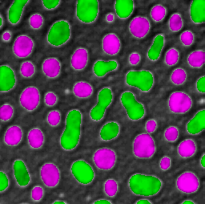

# Day 2 introductrion to Macro recording and programming

Scripting in ImageJ / FIJI allows you to produce reproducible workflows, for yourself and others. It:

* Improves science communication
* Allows automation, e.g. same analysis over thousands of images

## Schedule of the day (1h session)

* What is the macro language
* How to use the macro recorder
* Hot to go from recording to a simple macro

## What is the macro language

From the [Macro language Site](https://imagej.nih.gov/ij/developer/macro/macros.html) we have:

"A macro is a simple program that automates a series of ImageJ commands. The easiest way to create a macro is to record a series of commands using the command recorder. A macro is saved as a text file and executed by selecting a menu command, by pressing a key or by clicking on an icon in the ImageJ toolbar."

### Important resources

* Introduction to ImageJ's macro language: [Link](https://imagej.nih.gov/ij/developer/macro/macros.html)
* Built-in Macro Functions: [link](https://imagej.nih.gov/ij/developer/macro/functions.html)
* Image.sc forum: [link](https://forum.image.sc/)
* Cheat sheet by [Robert Haase](https://twitter.com/haesleinhuepf) and firends: [Link](https://github.com/BiAPoL/imagej-macro-cheat-sheet)

## Practical session

**Disclamer**: We will be working with [FIJI](https://imagej.net/Fiji/Downloads) for this practical. If you get stuck doing the tasks you can use the catchups for inspiration and help.

### Step 1: The recorder

To access the recorder go to the menu: `Plugins > Macros > Record...`

**Task 1**: Record a series of steps that segments the blob image.

Hints:

* To load the blob image use: `File > Open Samples > Blobs`
* Remember the use of `Image > Duplicate` to record intermediate steps
* Implement a pre-processing step: e.g. `Process > Filter > Median`
* Thresholding can be done via `Image > Adjust > Threshold`
* To then quantify, remember the use of `Analyze > Set Measurements` and `Analyze > Analyze particles`

**Catchup** Having problems look and example [here](./Macros/Macro_01.ijm)

### Step 2: Recroder 2 macro

**Task 2**: Now it is time to take that recording a clean it up into a simple macro.

Hints:

* In the recorder window click `create`
* Alternatively, go to:

  * `File > New > Script`
  * Change the language to imageJ macro via `Language > IJ1 Macro`
  * Copy paste what you need from the recorder

* In most cases, it is a good idea to always clean you ImageJ before you run commands, for example:

```
// clean up first
// close all images
close("*");
// empty the ROI manager
roiManager("reset");
// empty the results table
run("Clear Results");
// configure that binary image are black in background, objects are white
setOption("BlackBackground", true);
```

* Remember that you can add comments by using `//` af the start of a line, see example above
* To automatically open the Blobs image you can use `run("Blobs (25K)");`

**Catchup** Having problems look and example [here](./Macros/Macro_02.ijm)

### Step 3: Simple user input in the macro

**Task 3**: Let us ask the user to open an iamge and run the same analysis as before in that image

Hints:

* Have a look at the [built in macro functions for File](https://imagej.nih.gov/ij/developer/macro/functions.html#F)

  * `File.openDialog`
  * `File.getName`
  * `File.getParent`
  * `File.getNameWithoutExtension`
  * `getNumber("prompt", defaultValue)`

* Use the [cheat sheet](https://github.com/BiAPoL/imagej-macro-cheat-sheet)
* Have a look at how to get [Script parameters working](https://imagej.net/Script_parameters)
* For this example is enough to use `File.*` commands Ishowed above

**Catchup** Having problems look and example [here](./Macros/Macro_03.ijm)

### Step 4: Macro Language

**Task 4**: Follow the "Hello World" Example that is in [here](https://imagej.nih.gov/ij/developer/macro/macros.html#hello). Then go over the examples of variables and operators.

#### Variables and operators

**Variables** think of them as named boxes (memopry address) that have a type (e.g. string, number, etc.) and store a value

**Operators** think of them as tasks that you can perform on a **Variable** or several of them, e.g. multiplication.

#### Example of numeric variables and operatos in IJM
Here is an example code that creates 2 numeric variables, `a` and `b`, uses the `+` operator to sum and assign that value to a new variable `sum_out` and then prints that result

```
// init numeric variables
a = 3;
b = 2.7;
// use the sum operator
sum_out = a + b;
// print the results
print(sum_out);
```

**Important** note how in IJM we always (almost) finish the lines with a `;`

#### Example of string variables and operatos in IJM
Here is an example code that creates 2 string variables, `first_name` and `last_name`, uses the `+` operator to concatenate these strings and then prints that result.

```
// init strings
first_name = "Rafael";
last_name = "Camacho";
// concatenate and print
print("Hello " + first_name + " " + last_name);
```

#### Example of strings and numbers working together in IJM

[Here](./Macros/concatenate_strings_numbers.ijm) you find a combination of strings and numbers:

```
// init strings
first_name = "Rafael";
fn_length = lengthOf(first_name);
last_name = "Camacho";
ln_length = lengthOf(last_name);
// concatenate and print
print("\\Clear");
print("Hello " + first_name + " " + last_name);
print("Your first name (" + first_name + ") has " + fn_length + " letters");
print("Your last name (" + last_name + ") has " + ln_length + " letters");
```

**Task 5**: Print to the users how many objects were detercted in the blobs image

Hints, look at the commands:

* `roiManager("count")`
* `nResults`
* Store the number in a variable and then print to the user following the examples from taks 5

**Catchup** Having problems look and example [here](./Macros/Macro_04.ijm)

### Step 5: Control statements

In programming, **control satemensts** are used to decide the *flow* ofn the programm. This is how we tell the program what to do if somethings happens (`if-statement`) and to repeat a process a number of times (`for-loop`).

#### Example of for loops

This example of code [link](./Macros/for_loops.ijm) calculates the cumulative sum of sumber from 0-9 using a `for-loop`

```
// init variables
c_sum = 0;
print("\\Clear");
// for loop
for (i = 0; i < 10; i++) {
	c_sum = c_sum + i;
	print("Current index: " + i);
	print("Cumulative sum: " + c_sum);
	print("---------");	
}
```

Play close attention to the syntax, you can read as run the code between `{}` for `i = 0`, then add 1 to `i` (`i++`), run it again if `i` is smaller than 10 (`i < 10`), then add 1 to i (`i++`), ...

#### Example of if statements

This example of code [link](./Macros/if_statement.ijm) creates a random number between [0,10) and then prints if the number is larger or smaller than 5.

```
// init variables
r_number = random * 10;
print("\\Clear");
// if statement
if (r_number > 5) {
	print("Number is larger than 5: " + r_number);
} else {
	print("Number is smaller than 5: " + r_number);
}
```

Play close attention to the syntax, you can read this as if the condition is true, then run the code between `{}`

**Task 6**: colorcode the blobs image based on a property of the detected objects, e.g. circularity.



Hint, to solve this problem you have to combine the `for-loop` with the `if-statement` in something that looks like:

```
for (i = 0; i < nResults(); i++){
    c = getResults('Circ.', i);
    roiManager("Select", i);
    if(c > 0.9){
        // do something
    } else{
        // do something else
    }
}
```

An example of this pattern, outside of the ROI context can be found [here](./Macros/loop_and_if.ijm). I recommend you study that example first.


**Example of an Answer**: [here](./Macros/Macro_05.ijm) I show a working example to solve this question. Please keep in mind that "all roads lead to rome" and thus there are many ways to solve this problem.