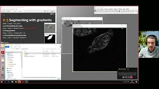
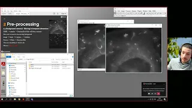

# Teaching-ImageJ-FIJI

List of resources used during different courses

# NorMIC 2022

Material used in the [9th NorMIC Workshop on Microscopy Image Processing](https://www.med.uio.no/ncmm/english/news-and-events/events/courses-and-workshops/2022/9th-normic-imaging-workshop).

I had the plesure to run a 2h practical session on bio-image analysis. The material used is available at [this site](./NorMIC/Day_1_Intro).

# NMI 2021

Short (30-minute) introductory lecture on BioImage Analysis using FIJI. [Go here for details](./NMI-2021)

This lecture was part of the [NMI 2021 open lectures](https://nmisweden.se/arkiv/4th-nmi-course-online.html)

[Here the link](https://youtu.be/_9TWrzm3vBg) for the recording of the live demo:

# NorMIC 2021

Material used in the [6th NorMIC Imaging Workshop](https://www.med.uio.no/ncmm/english/news-and-events/events/courses-and-workshops/2021/normic-imaging-workshop-course-in-advanced-light-m.html) and the [8th NorMic Workshop on Biologial Optical Microscopy](https://www.med.uio.no/ncmm/english/news-and-events/events/courses-and-workshops/2022/8th-normic-imaging-workshop)

* The material for the 1st practical session on bio-image analysis can be found [here](./NorMIC/Day_1_Intro).

* The material for the 2nd practical session on macro recording and basic macro programming can be found [here](./NorMIC/Day_2_Macro_recording).

## Workflow minimal examples

* [Segmentation via gradients](https://youtu.be/xk6FG7ZVwz8)

* [Temporal filtering - removing stationary background](https://youtu.be/nghiINTPeoQ)

* [Spot detection - Difference of Gaussias](https://youtu.be/rLTrXh3FWmc)

* [Length measurements](https://youtu.be/_7srHwCa7v0)

